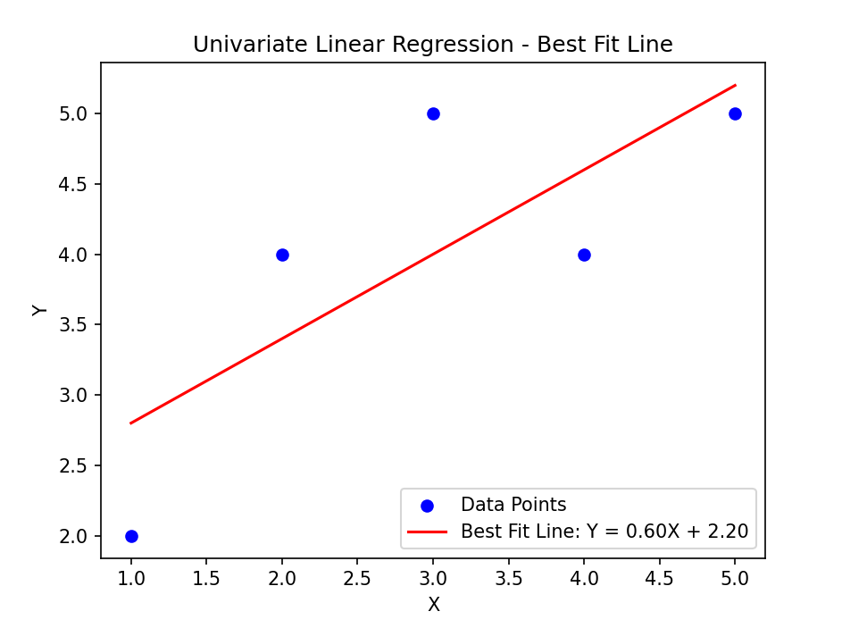

# Implementation of Univariate Linear Regression
## AIM:
To implement univariate Linear Regression to fit a straight line using least squares.

## Equipments Required:
1. Hardware – PCs
2. Anaconda – Python 3.7 Installation / Jupyter notebook

## Algorithm
1. Get the independent variable X and dependent variable Y.
2. Calculate the mean of the X -values and the mean of the Y -values.
3. Find the slope m of the line of best fit using the formula. 

4. Compute the y -intercept of the line by using the formula:

5. Use the slope m and the y -intercept to form the equation of the line.
6. Obtain the straight line equation Y=mX+b and plot the scatterplot.

## Program:
/*
Program to implement univariate Linear Regression to fit a straight line using least squares.

Developed by: R.Sairam

RegisterNumber:  25000694

*/

import numpy as np

import matplotlib.pyplot as plt

X = np.array([1, 2, 3, 4, 5])

Y = np.array([2, 4, 5, 4, 5])

X_mean = np.mean(X)

Y_mean = np.mean(Y)

numerator = np.sum((X - X_mean) * (Y - Y_mean))

denominator = np.sum((X - X_mean) ** 2)

m = numerator / denominator

b = Y_mean - m * X_mean

plt.scatter(X, Y, color="blue", label="Data Points")

plt.plot(X, Y_pred, color="red", label=f"Best Fit Line: Y = {m:.2f}X + {b:.2f}")

plt.xlabel("X")

plt.ylabel("Y")

plt.title("Univariate Linear Regression - Best Fit Line")

plt.legend()

plt.show()

print(f"Slope (m): {m}")

print(f"Intercept (b): {b}")

## Output:

## Result:
Thus the univariate Linear Regression was implemented to fit a straight line using least squares using python programming.

